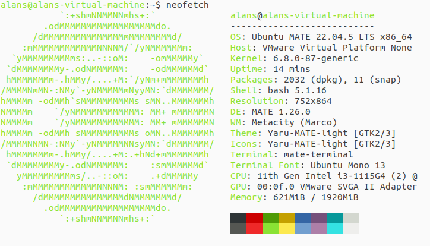

# Week 1: Linux CLI Mastery (OverTheWire Bandit)

**Goal**: Complete Bandit Levels 0–20  
**Tools**: Ubuntu MATE 24.04 LTS, VMware Player, SSH  
**Date**: Nov 1–7, 2025

---

## VM Environment
- **Hypervisor**: VMware Workstation 17 Player (Free)
- **OS**: Ubuntu MATE 24.04 LTS
- **Setup Date**: Nov 1, 2025
- 

---

## Levels Solved
| Level | Command Used | Key Learning |
|-------|--------------|-------------|
| 0 → 1 | `ssh bandit0@... -p 2220` | SSH login |
| 1 → 2 | `cat ./-` | Reading dashed files |
| ... | ... | ... |

---

## Key Commands Learned
```bash
ls, cd, cat, grep, find, ssh, nano, chmod
